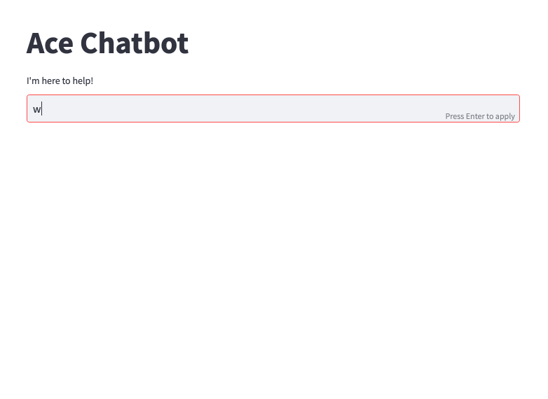

# Ace Chatbot

The Ace chatbot is an application of machine learning techniques that provides a conversational interface for students to interact with, for common advising questions. Ace is built on a neural network developed using TensorFlow and spaCy.

The chatbot is trained on 'patterns' for a particular question, matched to a tag, using natural language processing techniques such as tokenization and named-entity-recognition (NER) for extracting information. These techniques help the chatbot understand and respond appropriately to the user's messages.

Tokenization involves breaking down user messages into smaller units such as words or phrases, which allows the chatbot to more accurately understand the meaning behind user input. NER allows for extraction of relevant information such as course names or major declaration, allowing for more personalized assistance to the user. 

The Ace chatbot project is currently being worked upon and improved, and represents a powerful tool for businesses and organizations looking to improve customer engagement and automate customer support. By leveraging the power of machine learning, NER, and tokenization, the chatbot provides a seamless and personalized conversational experience for users.

Demo:

